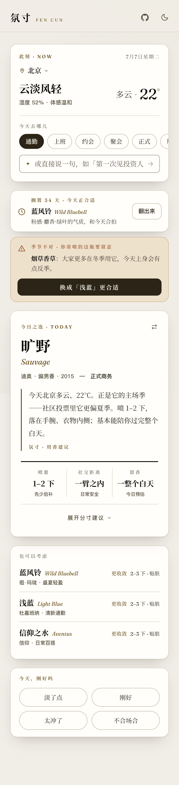
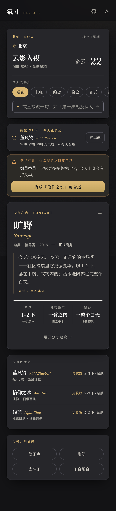
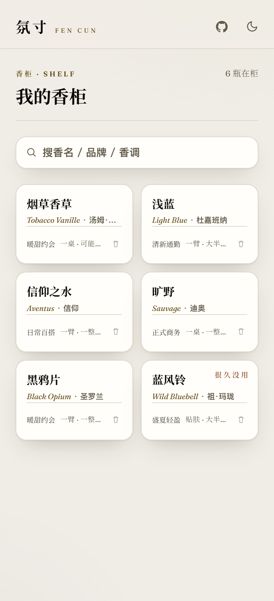
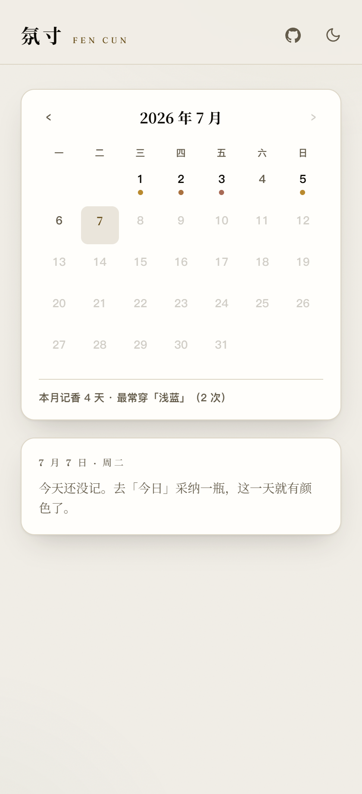
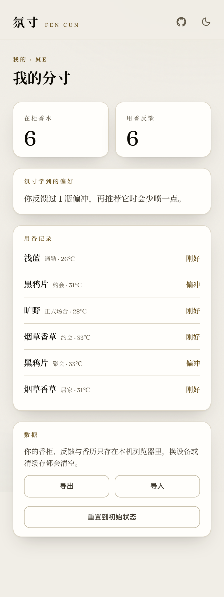
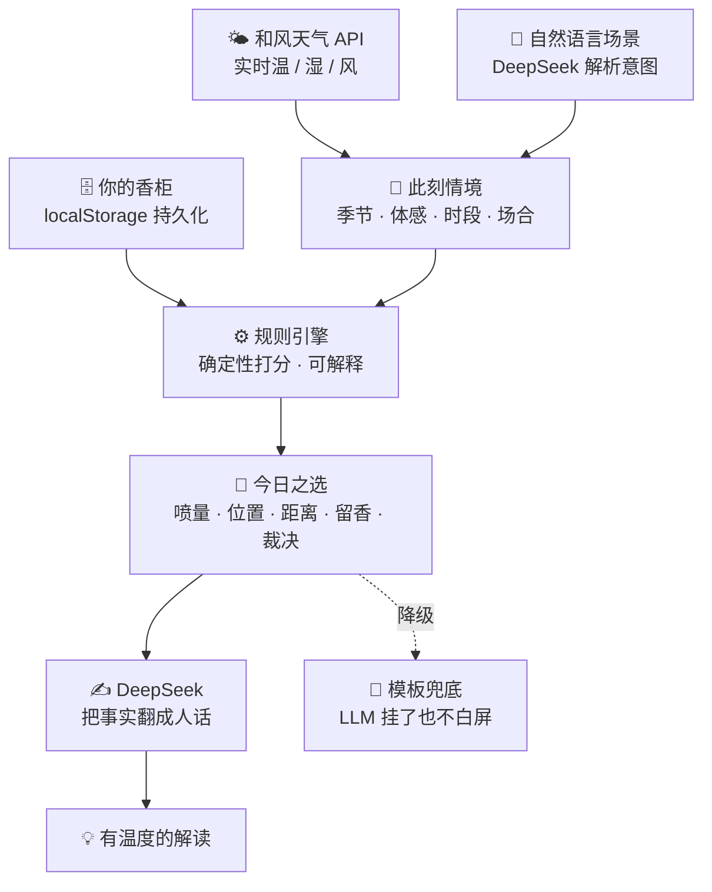

<div align="center">

# 氛寸 · Fēn Cùn

### 别人帮你**挑**香水，氛寸帮你**用好**香水

一个基于实时情境的个人 **「用香决策」Agent**：<br/>
从你**已有**的香柜里，告诉你此刻——**喷哪瓶、喷多少、喷在哪、能留多久、要注意什么，以及为什么。**

<br/>

[](https://fencun.vercel.app)


<br/>

<table>
  <tr>
    <td align="center"><br/><sub><b>今日之选 · 明韵</b></sub></td>
    <td align="center"><br/><sub><b>今夜之选 · 暗香</b></sub></td>
  </tr>
</table>

</div>

---

## 一句话

站在香柜前，你从不缺香水——缺的是「**今天到底用哪瓶、怎么用得恰到好处**」的那个判断。
氛寸不做导购、不做调香，只解决这一个每天真实发生的决策。

- **「今天喷哪瓶」** 是入口：你的香柜 × 此刻情境 → 最合适的一瓶，不认同可一键换成任意一瓶（用法即时重算）。
- **「这瓶怎么用」** 是灵魂：喷量档位 / 喷洒位置 / 社交距离 / 留香区间 / 风险提示，**全程只给区间与档位，不伪精确**。

> 完整产品方案见 [`docs/氛寸-产品方案.md`](docs/氛寸-产品方案.md)。

---

## 与「选香 / 导购」类产品有什么不同

| | 传统香水 App | **氛寸** |
|---|---|---|
| 解决的问题 | 买之前——**挑哪瓶** | 买之后——**今天用哪瓶、怎么用** |
| 输入 | 喜好、预算、评论 | **你已有的香柜 × 实时天气 × 场合** |
| 输出 | 种草、购买链接 | **可执行的用香建议 + 明确裁决 + 为什么** |
| 对待用户 | 尽量推荐、促成转化 | **不迁就**：真不合适就说「今天不建议这瓶」 |
| 精确度 | 「前调 30 分钟…」听感数字 | **只给区间与档位**，拒绝伪精确 |

---

## 核心能力

- 🎯 **今日之选 + 怎么用** — 情境自动感知（实时天气 + 此刻时段），从你的香柜打分推一瓶，附完整分寸建议。
- ⚖️ **不迁就的用香裁决** — `good / caution / avoid` 三档。真不合适就先说「今天不建议这瓶」，再告诉你坚持要用时怎么补救。
- 💬 **自然语言场景** — 输入「去前任婚礼」「第一次见投资人」，DeepSeek 解析出场合、正式度、关系张力、是否饭局等，喂进打分与用法。
- 🔔 **发现型钩子** — 主动提醒，而非等你来问：常喷的那瓶今天会翻车（急性天气 / 反季 / 场合预警，眉标按成因分岔）、搁置已久的那瓶今天正合适（吃灰提醒）。
- 🔁 **反馈闭环** — 答一句「今天，刚好吗」，个人偏移按瓶收敛：嫌冲，下次就少喷；答「刚好」，就记住这套配置直接复用；高温天答「淡了」，归因给天气，不冤枉香水。
- 🔂 **轮换有度** — 昨天刚喷的今天自然让位、久置的自然浮起，兑现「今天喷哪瓶每天不一样」。
- 📖 **香历** — 采纳或反馈的每一瓶自动落进月历（色点 = 当日主香调），点开任一天是当日快照，可补一句话手记。无香的日子留白，不做打卡不做断签。
- 🪞 **演示香柜** — 第一次打开就是满配：六瓶示例香水与近一个月的穿香记录，推荐、备选、预警、香历、画像全部有内容可看。六瓶全部取自主目录高票段，演示屏上每一句判断仍由真实社区数据算出。加进你自己的第一瓶，它就整体退场。
- 🌗 **昼夜双主题** — 「明韵 / 暗香」设计语言：思源宋体做中文嗓音，明韵是宣纸暖白、暗香是炭黑 + 香槟金。默认明韵，右上角随时切，不跟系统深浅色走。

<div align="center">
<table>
  <tr>
    <td align="center"><br/><sub><b>香柜 · 搜名秒加 / 吃灰标记</b></sub></td>
    <td align="center"><br/><sub><b>香历 · 穿香日历 / 一句话手记</b></sub></td>
    <td align="center"><br/><sub><b>我的分寸 · 偏好画像 / 用香记录</b></sub></td>
  </tr>
</table>
</div>

---

## 它怎么想

**决策权在规则引擎，表达权在 LLM。** 匹配打分、喷量与留香判定全部由确定性规则计算，可解释、可复现、有单测；DeepSeek 只做两件事——听懂自然语言场景、把规则算好的事实翻译成有温度的人话。天气永远来自和风天气 API。LLM 的输出还要过一道**数字白名单**：事实里没给过的数字（比如编造的「留香 6.2 小时」）整段拦下、退回规则模板。即便 DeepSeek 超时，规则引擎照样出推荐，产品不白屏。



### 打分公式（`src/lib/scoring.ts`）

```text
score =  ( 0.38·季节匹配 + 0.19·时段匹配 + 0.43·场合贴合 )   ← 线性主项，权重归一
       ×  天气乘子 W   ∈ [0.7, 1.3]                          ← 闷热压厚重、寒冷奖暖香
       ×  质量微调 Q   ∈ [0.96, 1.04]                        ← 社区口碑只作轻推，不替你挑瓶
       ×  个人偏移（按瓶偏好 · 场合差评）                     ← 你的反馈收敛而来，正负双向、按月衰减
       ×  场景压制（规避项 · 张力与正式度）                   ← 「别太甜 / 别太冲」硬降权，高张力先压存在感

rank  =  score × 轮换新鲜度 F(d) × 换瓶隐式差评                ← 只动排序，不动裁决与展示
```

> 场合权重刻意略高于季节——**「今天去哪儿」比「现在什么季」更该决定喷哪瓶**（急性温度由乘性 W 兜底）。质量先验被压成 ±4% 的轻推，避免高分香跨场景通吃。

---

## 四条戒律（继续开发必须守）

1. **不伪精确** — 留香 / 喷量 / 社交距离只给区间与档位，绝不给「6.2 小时」这类无法验证的假数字。
2. **不过度设计** — 不上向量库；规则引擎在浏览器本地毫秒出结果，零延迟零成本。
3. **轻冷启动** — 搜名秒加建香柜，不逼用户先填一堆问卷。
4. **有反馈闭环** — 每次推荐都能被评价、被修正，个人偏移持续收敛。

---

## 技术栈

| 层 | 选型 | 说明 |
|---|---|---|
| 框架 | **Next.js 16**（App Router）+ **React 19** + **TypeScript 6** | 一仓库承载前端与轻后端 |
| 后端 | **Route Handlers** | 代理和风/DeepSeek，保护 key + 缓存 + 限流 + 降级 |
| 样式 | **Tailwind v4**（CSS-first `@theme` token，无 UI 库） | 昼夜双主题、自持字体 |
| 决策 | **确定性规则引擎**（纯 TS） | 前端本地打分，可解释可单测 |
| 检索 | **MiniSearch 7**（自定义中英文分词） | 搜名 / 品牌 / 香调秒加 |
| 状态 | **Zustand 5** + localStorage | 香柜与反馈持久化，接口已抽象可换 Supabase |
| 语义 | **DeepSeek**（`deepseek-v4-flash`） | 场景解析（`json_object` + zod 校验）+ 自然语言解读 |
| 天气 | **和风天气 QWeather** | 服务端调用 + 30 分钟网格缓存 |
| 校验 / 部署 | **zod** · **Vercel** | 入参校验、GitHub 自动部署 |

---

## 数据

香水数据来自 **ledecanteur**（Fragrantica 社区数据），含真实社区投票：扩散 sillage(1–4)、留香 longevity(1–5)、四季 / 日夜投票、带强度香调、前中后调。

- **分层**：原始 13.2 万款，按投票数 ≥ 50 筛得 3.67 万款。主目录取热度 **Top 1500 全中文精选**；其余进**扩展集**（索引懒加载，详情按 64 个分片取，含 779 款靠国货白名单破格放行的低票记录）；再搜不到，还有**手动记一瓶**兜底——每一瓶都进得来。
- **统一榜单**：主目录与扩展集合并重排、不分区，文本匹配档位优先、同档位按社区投票的主流度——高度匹配的结果永远靠前。
- **中文化**：香调 / 气味词近全覆盖；香名 **89.0%** 有中文名——官方名 544、香圈通行绰号 39、直译 752。剩下 165 款没有可靠中文名，保留英文——错的中文名比英文更糟。原始数据不入仓库，仅提交构建产物；完整管线与数字见 [数据工程](docs/数据工程.md)。

---

## 本地运行

需要 Node 24（版本的唯一事实源是 `package.json` 的 `engines.node`）。

```bash
npm install
cp .env.example .env.local   # 各项 key 的用途与申请入口见文件内注释（.env.local 已被 git 忽略）
npm run dev                  # http://localhost:3000
```

没有 key 也能跑：天气走「季节 + 时段」降级，解读走规则模板。

数据管线（可选，仓库已含构建产物）：

```bash
npm run extract:terms  # 从本地 ledecanteur/ 流式抽取精选子集与词表
npm run build:data     # 应用中文映射 + 预计算 → public/data/perfumes.min.json
npm run build:ext      # 全量扩展集：搜索索引 + 64 详情分片 → public/data/ext*
```

门面素材（需先起**生产**服务器，`next dev` 的调试悬浮球会入镜）：

```bash
npm run build && npx next start -p 3100
SHOT_BASE=http://localhost:3100 npm run shot   # README 截图 → .scratch/shots/
SHOT_BASE=http://localhost:3100 npm run og     # 分享卡片与 PWA 图标 → public/
```

两个脚本都把无头浏览器开到站点自己的页面上再取材，所以字体、配色与排版和线上**同源**，不会出现"分享卡是一套设计、点进来是另一套"。截图用的就是演示香柜本身——门面图与初次到访者看到的是同一份数据。

---

## 目录结构

```text
src/
  app/                  今日 / 香柜(library) / 香历(journal) / 我的(profile) 四页 + API 路由
    api/context/        和风天气代理（保护 key + 网格缓存 + 降级）
    api/explain/        DeepSeek 解读（只翻译规则事实，失败降级模板）
    api/parse-intent/   DeepSeek 场景解析（zod 校验，降级关键词启发式）
  components/           AppProvider / 推荐卡 / 情境栏 / 发现型钩子 / 搜索添加(SearchAdd)
                        / 手动记一瓶(ManualAdd) …
  lib/                  types · scoring(打分) · usage(用法) · recommend(编排)
                        · journal(香历) · perfumes(统一搜索 + 扩展目录)
                        · numguard(数字白名单) · nudges(发现型钩子，纯函数)
                        · season · hooks · store · ratelimit
                        · demo(演示香柜黄金集，纯函数)
scripts/                零依赖数据构建管线 + 截图 / 分享素材 / 依赖审计门禁
data/zh-map/            英文→中文映射（accords / notes / brands / names）
docs/                   产品方案 · 领域规则手册 · 数据工程 · 声音与文案 · 截图
```

---

## 文档地图

- [产品方案](docs/氛寸-产品方案.md) — 定位、评分逻辑、关键决策、指标与路线图。
- [迭代实录](docs/迭代实录.md) — 上线后关键迭代的动因与取舍。
- [领域规则手册](docs/领域规则手册.md) — 打分与用法规则背后的香水领域依据。
- [数据工程](docs/数据工程.md) — 13.2 万 → 3.67 万 → 中文映射的完整管线。
- [声音与文案](docs/声音与文案.md) — 产品怎么说话：术语、语气与边界。

---

## 参与 · 许可

- **贡献**：欢迎 Issue 与 PR；动手前请读 [贡献指南](.github/CONTRIBUTING.md)——尤其是四条戒律。
- **获取帮助**：不知道去哪问？先看 [SUPPORT](.github/SUPPORT.md) 的分流表。
- **行为准则**：本项目遵循 [Contributor Covenant](.github/CODE_OF_CONDUCT.md)。
- **安全**：发现漏洞请按 [安全政策](.github/SECURITY.md) 私下报告，勿开公开 Issue。
- **治理与路线图**：谁说了算、什么不进主线见[贡献指南 · 治理](.github/CONTRIBUTING.md#治理--governance)；路线图在 [产品方案](docs/氛寸-产品方案.md)。
- **版权与许可**：Copyright © 2026 MrBaoboer。源代码以 **AGPL-3.0-only** 授权（见 [LICENSE](LICENSE)）；作为网络服务，若你部署修改版，请依 AGPL §13 向使用者提供对应源码。
- **品牌**：「氛寸」名称、标识与站点文案不在 AGPL 授权范围内，依 §7(e) 保留；分发或部署修改版请使用你自己的名称与标识。
- **数据出处**：`public/data/` 派生自 **ledecanteur / Fragrantica** 社区数据，版权归原始来源，**不随代码按 AGPL 授权**；仅供学习与展示，另作他用请自行核实来源许可。
- **第三方**：随产物分发的字体与依赖见 [THIRD-PARTY-NOTICES](THIRD-PARTY-NOTICES.md)。

---

<div align="center">

**氛寸** —— 让每一瓶香，都用在它最好的那一刻。

[在线体验](https://fencun.vercel.app) · [产品方案](docs/氛寸-产品方案.md)

</div>
