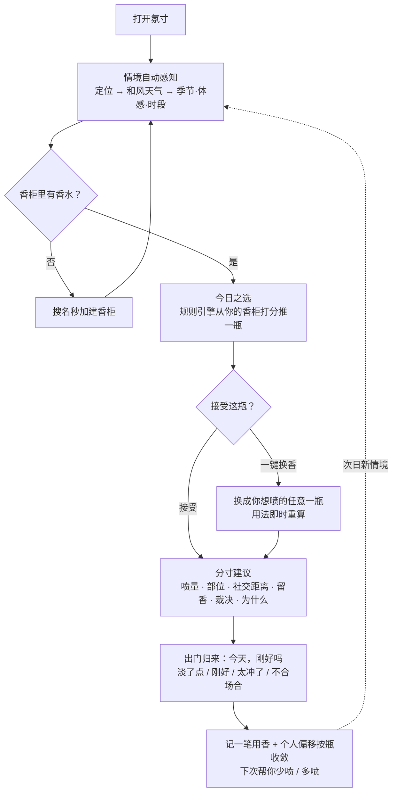
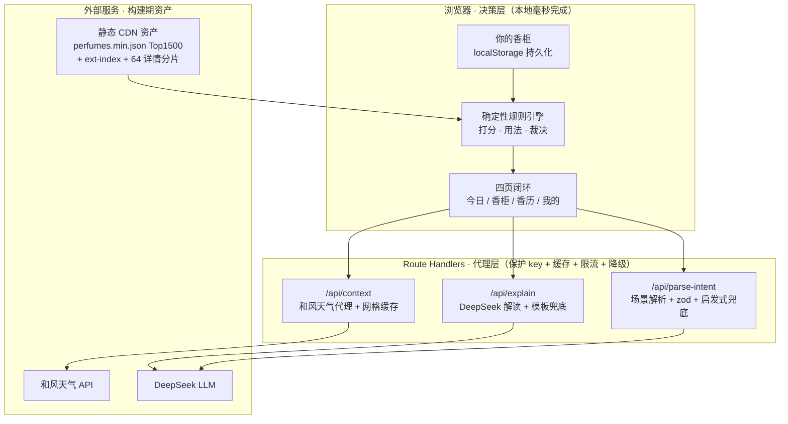
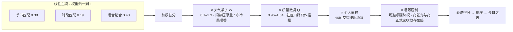

# 氛寸 · Fēn Cùn —— 完整产品方案

### 从香柜前的那三秒说起

**氛＝无形的氛围，寸＝有形的尺度。** 一个基于实时情境的个人「用香决策」Agent—— 
不帮你**挑**香水，帮你**用好**你已经拥有的香水。

&nbsp;

> README 是 30 秒的门面，这里是完整方案：定位、用户、产品模型、评分逻辑、关键决策、指标与路线图。
> 配套文档：[迭代实录](迭代实录.md) · [领域规则手册](领域规则手册.md) · [数据工程](数据工程.md) · [声音与文案](声音与文案.md)

---

你站在香柜前。八瓶香水，今天穿深色、要见客户、外面 30℃ 闷。

你不缺香水，缺的是那句判断：**今天该喷哪瓶、喷几下、会不会在会议室里太张扬。**
大多数人的解法是无脑喷那瓶「老相好」，于是另外七瓶常年吃灰——而那瓶老相好，在盛夏正午和冬夜地铁里其实是两种完全不同的东西。

氛寸接手的，就是这三秒。

---

## TL;DR

| | |
|---|---|
| **一句话** | 你已经有这些香水，氛寸帮你决定此刻该喷哪一瓶、并把它用得恰到好处。 |
| **和别的香水产品差在哪** | 国内产品都在帮你**买下一瓶**（香评、种草、导购、AI 调香）；氛寸只帮你**把手里的用好**。买只发生一次，用发生每一天。 |
| **为谁** | 已拥有 ≥3 瓶香水、常「喷错 / 喷多 / 不知道今天用哪瓶」的轮换型用户。 |
| **核心能力** | 推荐（香柜 × 此刻情境）→ 可换（决策权在你）→ **教你怎么用**（喷量 · 部位 · 社交距离 · 留香 · 裁决 · 为什么）。 |
| **技术内核** | 决策权在**确定性规则引擎**（前端本地、可复现、有单测），表达权在 **LLM**；天气只来自和风天气 API，全链路可降级。 |
| **状态** | 响应式 Web 四页闭环（今日 / 香柜 / 香历 / 我的），已上线 [fencun.vercel.app](https://fencun.vercel.app)。 |

---

## 一 · 问题与机会

同一瓶香，好不好从来不取决于它本身，而取决于它与天气、体感、场合，以及你今天想成为谁之间的关系。一个轮换型用户的香柜里往往躺着 5–10 瓶，日常却只喷那瓶最熟的，其余常年吃灰。**人们不缺香水，缺的是站在香柜前那三秒的判断。**

国内主流产品没有接手这三秒：

| 产品 | 定位 | 解决的问题 |
|---|---|---|
| 香水时代（NoseTime） | 香评百科 + 社区 + 商城 | 帮你**发现、购买新香水** |
| 嗅氪 AI 调香 | AI 定制调香 | 帮你**创造一瓶新香水** |
| **氛寸** | 用香决策 Agent | **管理你已有的香水，教你在不同情境下怎么用** |

「你的香柜 × 此刻情境 → 今天喷哪瓶 + 怎么用」这个闭环，国内是空白；海外有 Sillage、Kaori 等同型尝试（例如 Sillage 每天清晨按温湿度从用户收藏中推荐当日用香），说明方向真实存在。把它本土化到中国、并把「怎么用」做深，是氛寸的机会。

---

## 二 · 目标用户与真实痛点

用户画像刻意收窄，分三层：

| 人群 | 特征 | 对产品的意义 |
|---|---|---|
| 🎯 **纠结的轮换者**（核心） | 有 3–10 瓶，每天纠结用哪瓶、怕喷错喷多 | 频次最高的基本盘 |
| **场合敏感者** | 关键场合（约会 / 面试 / 婚礼）临时求稳 | 事件触发的口碑放大器 |
| **钻研型爱好者** | 懂香、在意用香礼仪 | 专业背书与高质量反馈 |

把模糊的「不会用」拆成四个可被接住的瞬间：

| 用户的真实困境 | 决策缺口 | 氛寸如何接住 |
|---|---|---|
| 「今天到底喷哪瓶？」 | 情境 → 香水的匹配判断 | 今日之选：香柜 × 天气 × 场合打分推荐 |
| 「喷多少才不失礼？」 | 扩散与场合的分寸感 | 喷量档位 + 社交距离 + 密闭场合风险 |
| 「这瓶今天会不会翻车？」 | 急性天气 / 反季预警 | 用香裁决 `avoid` + 天气突变预警 |
| 「好香买了却吃灰。」 | 被遗忘香水的再激活 | 吃灰提醒：合适情境顶出冷落瓶 |

> **产品洞察**：「今天喷哪瓶」其实是弱痛点——无脑喷老相好也不痛苦。真正让用户「咦一下」的，是产品替他发现了**他没意识到的问题**：那瓶好香在吃灰、那瓶常喷的今天会翻车。所以价值重心押在这两个**发现型钩子**上。

---

## 三 · 产品方案：先推荐 + 可换 + 教你怎么用

核心路径要平衡两件事：推荐能力与用户自主权。默认推荐照顾懒人与新手；推荐的都是用户自己已有的香水，而且随时可以换。无论接受还是换瓶，最终都进入同一层核心能力——基于情境的用香建议。

三层能力，缺一层就退化成「又一个选香工具」：

1. **推荐** — 你的香柜 × 此刻情境 → 最适合的一瓶。
2. **可换** — 一键换成任意一瓶，用法即时重算。没有「可换」，推荐就成了强加。
3. **教你怎么用**（灵魂）— 喷几下、喷在哪、社交距离、留香区间、有无风险、以及为什么。

产品对每次推荐还给出明确裁决 `good / caution / avoid`：真不合适就先说「今天不太建议用这瓶」，再告诉你坚持要用时怎么补救。一个会替你踩刹车的助手，比永远说「都很棒」的助手可信。这条裁决有代码级保障——LLM 若把该劝退的话说软，服务端会自动换回确定性模板。

> **战略表达**：「今天喷哪瓶」是**传播入口**——直观、一句话讲清，负责拉新；「这瓶怎么用」是**长期壁垒**——需要理解场景、偏好并持续学习，是抄不走的慢变量。用前者把人吸引进来，用后者把人留下。

### 六个真实场景

| 场景 | 氛寸介入 | 它会说 |
|---|---|---|
| 早间通勤 | 打开即见今日推荐 | 「上海 28℃、湿度 80%、闷。从你的香柜选**蓝风铃**：清爽柑橘扛这种黏腻天。喷 2 下（手腕＋颈侧），别上身。」 |
| 重要场合确认 | 输入「见客户」 | 「你选的**信仰之水**在商务场偏稳。但今天室内空调密闭，建议只喷 1 下、喷衣领内侧。」 |
| 换香后不确定 | 一键换香 | 「换成**烟草香草**没问题。它偏甜偏厚、扩散外放，今天 30℃ 建议减到 1 下、只喷手腕。」 |
| 🚩 **天气突变预警** | 情境刷新自动提示 | 「今天骤降到 12℃ 还下雨——你常喷的清新柑橘会被压住、留不住。香柜里的**香料炸弹**更扛冷湿天，要不要换？」 |
| 🚩 **吃灰提醒** | 合适情境顶出冷落瓶 | 「这瓶你 35 天没碰了——今天干冷的天正是它的主场，翻出来？」 |
| 用后复盘 | 推荐卡下一问（每瓶每天一次） | 「今天，刚好吗〔淡了点 / 刚好 / 太冲了 / 不合场合〕」——一次点击，收敛明日用法。 |

🚩 标记的两个是<b>发现型钩子</b>，也是氛寸真正的价值重心。

---

## 四 · 核心用户路径

---

## 五 · 工程内核：决策权在规则，表达权在 LLM

这是整个产品最重要的技术判断，也是它区别于「套壳 GPT」的地方。

**匹配打分、喷量 / 距离 / 留香判定，全部由确定性规则计算——可解释、可复现、有单测。LLM 只做两件事：听懂自然语言场景、把规则算好的事实翻译成有温度的人话。天气永远来自和风天气 API，绝不让 LLM 编造。**

它的 Agent 属性不体现在「由 LLM 拍板」上：它主动感知情境；没人提问也会先开口，天气突变预警和吃灰提醒都是主动出手；行动之后收反馈、自我修正。决策器官是规则引擎，这恰恰让每个决定都可审计。

| 任务 | 谁做 | 为什么 |
|---|---|---|
| 匹配打分、排序 | **规则引擎** | LLM 打分不可复现；规则每一分都能拆给用户看 |
| 喷量 / 部位 / 距离 / 风险 | **规则引擎** | 这是壁垒，交给 LLM 会产生幻觉 |
| 自然语言 → 结构化情境 | **LLM** | 规则穷举不了「去前任婚礼」「第一次见投资人」 |
| 把结果翻成有温度的解释 | **LLM** | 像「懂香水的朋友」；但只能基于规则给定的事实，不准改结论 |

> **AI 产品设计判断**：太多产品把 LLM 放在决策链正中央，结果不可复现、会幻觉、还贵。氛寸的选择相反——让 LLM 待在它真正擅长的两端（理解与表达），把中间的决策交给可审计的规则。LLM 挂了，规则引擎照样出推荐与模板用法。

### 质量防线

- **136 个确定性单测**（`npm test`）锁定权重归一、喷量与排序不变式、轮换、环境归因、数字白名单与导入导出边界，并用真实构建产物做搜索端到端回归——重构改错权重会被当场逮住。
- **全链路降级**：LLM 超时退模板、定位失败按季节与时段推荐、`avoid` 被说软自动回退、LLM 输出出现事实之外的数字整段拦截；三条 API 路由的入参先校验后放行（explain 走 zod 结构化校验，parse-intent 入参截断到 120 字、出参走 zod，天气路由校验坐标范围与城市长度）。
- **加载与数据韧性**：目录加载失败自动重试，绝不把满柜误显示成空柜；香柜与反馈可一键导出 / 导入。

---

## 六 · 评分引擎：从模糊直觉到可解释规则

香水适配极度模糊，目标是把它拆成**每一分都能向用户解释**的确定性公式（`src/lib/scoring.ts`）。

**几个关键设计，都来自真实数据的诊断：**

- **场合权重（0.43）略高于季节（0.38）**——「今天去哪儿」比「现在什么季」更该决定喷哪瓶，急性温度由乘性 W 兜底。
- **质量先验压成 ±4%**——不压住它，社区高分香会跨场景通吃，什么场景都推同一瓶。压成轻推后，推荐由场景、季节、天气决定，而不是社区评分替你决定。
- **时段项相对自身主场归一**——让「白天香 / 夜香」这个维度真正发挥权重，不被原始占比稀释。
- **近似同分按本地日稳定轮换**——先严格按分排序，再对近似同分做簇内轮换，种子取本地日历日。「今日之选」全天稳定，跨天在本地零点切换。
- **轮换只动排序、不动裁决**——排名分 = 内容分 × 新鲜度 F(d) × 换瓶隐式差评。昨天刚喷的今天自然让位，久置的自然浮起；「这瓶适不适合今天」与「要不要连着喷它」是两个问题。

### 四条戒律（继续开发必须守）

1. **不伪精确** — 留香 / 喷量 / 社交距离只给区间与档位，绝不给「6.2 小时」这类无法验证的假数字。
2. **不过度设计** — 不上向量库；规则引擎在浏览器本地毫秒出结果。
3. **轻冷启动** — 搜名秒加建香柜，不逼用户先填问卷。
4. **有反馈闭环** — 每次推荐都能被评价、被修正，个人偏移持续收敛。

---

## 七 · 反馈闭环：越用越懂你

出门归来，答一句「今天，刚好吗」——`淡了点 / 刚好 / 太冲了 / 不合场合`（每瓶每天一次）。每一档都有明确去向：

- **太冲了** → 下次帮你少喷；
- **淡了点** → 先做**环境归因**：高温闷湿天的「淡」是天气吃掉了留香，不动你的喷量校准，回复也会明说；
- **刚好** → 沉淀为**成功配置**（温度档 × 场合 × 喷量），下次同样情境直接照那次的量来，并明说「按你上次满意的配置」——**被感知的校准才是留存钩子**；
- **不合场合** → 只降它在这个场合的权重，别的场合不受牵连；
- 把主推手动换掉也是一票（隐式差评）：7 天内有两天换掉它，它就先让位一段时间。

所有偏移正负双向、有界、按月轻度衰减——口味会变，偏置不能只增不减。反馈只对「你的这瓶」做个人化偏移，不污染全局社区数据。

---

## 八 · 数据：每条建议都来自真人投票

**厂商说「持久 8 小时」不可信，三千人投票的均值可信。** 氛寸的数据来自 ledecanteur（Fragrantica 社区数据），留香、扩散、四季、日夜全部是真实投票分布。

| 环节 | 处理 |
|---|---|
| **漏斗** | 原始 13.2 万款 → 投票数 ≥ 50 筛得 3.67 万款 |
| **分层** | 主目录 Top 1500 全中文精选；其余 3.6 万款进扩展集（索引懒加载 + 64 分片按需取），含 779 款靠国货白名单破格放行的低票记录；再搜不到还有手动记一瓶兜底 |
| **统一榜单** | 主目录与扩展集合并重排、不分区：文本匹配档位优先，同档位按社区投票的主流度——高度匹配的结果永远靠前 |
| **中文化** | 香调、气味词近全覆盖；香名 89.0% 有中文名——官方名 544 · 香圈通行绰号 39 · 直译 752；无可靠中文名的 165 款保留英文——错的中文名比英文更糟 |

> **工程判断**：「小而全中文」与「大而露英文」不是二选一，分层可以两全——主目录负责体验，扩展集负责覆盖。完整管线与数字见[数据工程](数据工程.md)。

---

## 九 · 架构与模块

`src/lib` 为纯逻辑核心（不含测试）：

| 层 | 模块 | 职责 |
|---|---|---|
| 情境层 | `season.ts` · `/api/context` · `/api/parse-intent` | 季节 / 体感 / 时段推断；实时天气；自然语言场景解析 |
| **决策层（壁垒）** | `scoring.ts` · `usage.ts` · `recommend.ts` | 打分排序；喷量 / 部位 / 距离 / 留香 / 风险；编排与裁决 |
| 检索层 | `perfumes.ts` | 中英文分词搜索；主目录与扩展集统一榜单；分片按需加载 |
| 个性化层 | `aggregateBias` · `nudges.ts` | 反馈 → 个人偏移；发现型钩子（纯函数，now 是入参） |
| 记录层 | `journal.ts` | 香历：月历网格、当日快照、备选差异标签 |
| 首访层 | `demo.ts` | 示例香柜：六瓶黄金集 + 一个月穿香排期，纯函数、时间相对当下生成 |
| 表达层 | `/api/explain` · `numguard.ts` | LLM 解读；数字白名单；模板兜底 |
| 状态层 | `store.ts` | 香柜 / 反馈持久化，存储接口已抽象、可平滑换云端 |

> **分层原则**：重计算（打分）在前端本地，重 key（天气、LLM）在服务端，重数据在构建期固化成静态 CDN 资产——三者不混。技术栈明细见 [README](../README.md)。

---

## 十 · MVP 边界

MVP 的取舍只问一句：「**不做这个，核心闭环会不会断？**」

「情境 → 决策 → 用法 → 反馈 → 记录」闭环之内的全部上线（见[路线图](#十三--路线图)）；闭环之外的刻意后置：

| 后置项 | 为什么现在不做 |
|---|---|
| 账号 / 云同步 | localStorage 最快验证核心价值；存储接口已抽象，后接账号业务层零改动；导出 / 导入兜住数据迁移 |
| 向量库 / 语义检索 | 当前全是结构化字段的数值比较，规则引擎直接算；向量库是「全库语义发现」阶段的工具 |
| 按用户拟合的在线模型 | 冷启动期每用户样本量太小，拟合即过拟合；「全局规则 + 个人硬偏移」简单且当场可感 |
| UGC 社区 / 商城 / 穿搭识别 | 不在「今天怎么用」主线上，避免资源发散 |

---

## 十一 · 关键决策

每个决策都写清判断与代价。

| 决策 | 判断 | 代价 |
|---|---|---|
| **不做导购，做「买之后」** | 国内产品都停在「买」，「用」是每天发生却无人接手的空白 | 放弃了赛道里唯一被验证的变现路径 |
| **价值重心押在发现型钩子** | 「今天喷哪瓶」是弱痛点，「替你发现吃灰 / 翻车」才是增量价值 | 赌注押在「用户没意识到的问题」上，需要数据持续验证 |
| **决策归规则、表达归 LLM** | LLM 在决策链正中央 = 不可复现 + 幻觉 + 高成本 | 长尾场景要人工扩规则，赌当前阶段可解释比聪明更值钱 |
| **不伪精确** | 无法验证的精确会摧毁信任 | 放弃「留香 6.2 小时」式的专业观感 |
| **不迁就的裁决** | 会踩刹车的助手比只会夸的助手可信 | `avoid` 会得罪只想被夸的用户 |
| **小而全中文优先** | 中文缺失直接摧毁国内体验，先聚焦 1500 款做到近满覆盖 | 长尾覆盖后置，靠扩展集与统一榜单补齐 |
| **localStorage 先行** | 用最轻的存储验证核心价值，不赌未验证的架构 | 暂无跨端同步，账号与云同步排在中期 |
| **统一搜索榜单** | 用户反馈：结果被折叠在「更多结果」区隔里，让人误以为上面就是全部。定案：文本档位优先、同档位按主流度合并重排 | 放弃「分区 = 来源清晰」的工程直觉，承担跨索引排序的复杂度 |
| **香历留白不谴责** | 无香的日子也是分寸，断签焦虑是让用户替指标打工 | 放弃打卡 / 连击这类已被验证能拉活跃的机制 |

---

## 十二 · 壁垒、指标与商业

### 壁垒

「今天喷哪瓶」这个交互本身没有护城河，氛寸押的是两件抄不走的事：

1. **在位者的动机错配窗口**。香水时代、电商的 KPI 都指向「卖下一瓶」，「帮你把已有的用好」是它们看不上的长尾——不是做不了，是没动力做。这个时间差就是先发的心智窗口。
2. **随时间加深的个人化数据**。按瓶个人偏移越用越准——产品形态抄得走，这份数据抄不走。账号与云同步排在中期，正是为了让这份数据长期沉淀。

### 指标体系

**北极星：先说放弃了什么。** 第一个否掉的是 DAU：用香决策的真实频率就是每周几次，强拉日活只会做出骚扰式推送。香柜瓶数也不行，它是存量不是行为。推荐展示次数同样不行——那是供给侧数字，度量不了用户认不认账。

北极星定为「**周度有效决策数**」：一周内，用户看过分寸建议后**以行动确认**的决策次数。采纳并反馈、一键换香、翻出吃灰瓶都算，光打开不算。氛寸的价值主张是接管「香柜前那三秒」，这个指标数的正是那三秒被真实接管了几次，而且天然防刷——不行动就不计数。香历一天至多一条、只在采纳或反馈时落账，当周香历的落账天数，就是它的下界。

| 层 | 指标 | 口径 |
|---|---|---|
| 激活 | 首访建柜 ≥1 瓶 | 首次访问当天，香柜是否入了第一瓶 |
| 参与质量 | 反馈提交率 | 四档反馈次数 ÷ 推荐到达次数 |
| 参与质量 | 换香率 | 换掉主推另选一瓶的占比 |
| 参与质量 | 吃灰采纳率 | 吃灰提醒被真实采纳的占比 |
| 留存 | 周活跃 / 4 周留存 | 当周 ≥1 次有效决策；首个有效决策后第 4 周仍有 |

换香、吃灰采纳与反馈已在本机埋点，服务端聚合度量排在中期路线图。

**反虚荣原则：指标度量产品，不许反过来改变产品行为。** 不做签到、不做连击、不做成就徽章；每个埋点都挂在用户本来就要做的动作上，没有任何交互是为了产出数据而存在的。

**验证机制。** 阈值基线要等服务端数据跑满 4–8 周再定，判断逻辑现在写死：换香率长期趋零，说明「可换」没创造增量价值；吃灰采纳趋零，说明发现型钩子押错方向；反馈用户与沉默用户留存无差异，说明个人化飞轮不转。

### 商业模式（守住非导购）

变现方向与定位不冲突：订阅制卖「分寸」本身——更细的个人香水画像、年度用香回顾、季节轮换指南，不碰交易、不种草，与在位者的导购逻辑形成结构性区隔。付费与定价的测算，等留存与反馈率立住之后再做。

---

## 十三 · 路线图

**已上线**（四页闭环：今日 / 香柜 / 香历 / 我的）

- **数据与搜索**：主目录 1500 全中文 + 3.6 万扩展集统一榜单 · 手动记一瓶兜底 · 国货白名单
- **决策与用法**：规则推荐 + 分寸建议 · 用香裁决 · 轮换与换瓶隐式差评 · 备选差异标签 · 自然语言场景（关系张力 / 时长档 / 饭局）· 天气突变预警 + 吃灰提醒
- **反馈与记录**：四档反馈 → 个人偏移（环境归因 / 成功配置复用 / 按月衰减）· 香历（穿香日历 + 当日快照 + 一句话手记）
- **首访**：示例香柜（六瓶高票段 + 近一个月穿香记录，进门即满配；加进自己的第一瓶就整体退场）
- **表达与韧性**：数字白名单 · 昼夜双主题 · 限流与全链路降级 · 导出 / 导入 · 136 用例单测

**中期 · 深化个性化与资产化**
香名中文化冲 95%＋ · 多维偏好画像（怕甜 / 怕冲 / 调性敏感）· 香历月度小结与季节轮换报告 · 迁 Supabase（账号 / 跨端同步）· 指标接入服务端度量。

**长期 · 变现（守住非导购）**
订阅高级版：个人香水画像、年度用香回顾、季节轮换指南。

---

## 附 · 设计语言 · 明韵 / 暗香

- **双嗓音排版**：中文用思源宋体，西文与数字用 Fraunces 衬线，自持字体、按需子集。
- **昼夜双主题**：明韵是宣纸暖白 + 高对比近黑，暗香是中性炭黑 + 香槟金点缀。**默认恒为明韵**，由用户手动切换，不按时段翻也不读系统深浅色——主题是产品的固定面貌，不是一个会自己变的环境读数。
- **可信化表达**：香调渲染为横向证据条，留香给「大半个白天」不给「6.2 小时」。
- **克制动效**：只在卡片入场、证据条增长、换瓶重排三处用，禁循环与弹跳。
- **品牌化术语**：香柜 · 今日之选 · 换一瓶 · 分寸建议 · 「今天，刚好吗」· 香历。

---

本项目由我独立完成从 0 到 1：问题定义、产品设计、算法规则、全栈工程与上线运营。过程中的关键取舍见[迭代实录](迭代实录.md)。

---

**氛寸** —— 让每一瓶香，都用在它最好的那一刻。

**「我做的不是香水导购，是香水的天气预报。」**

[在线体验](https://fencun.vercel.app) · [30 秒速览 README](../README.md)

