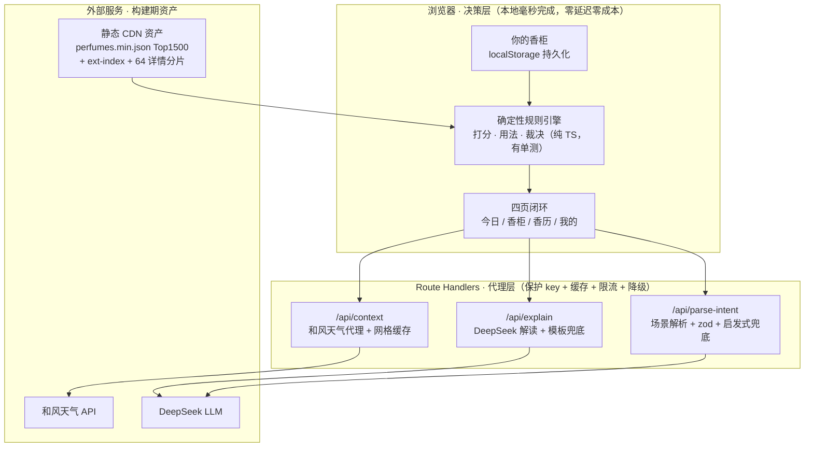
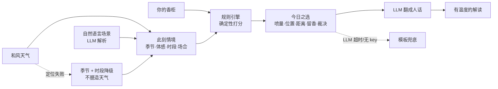
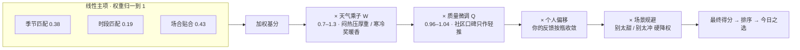
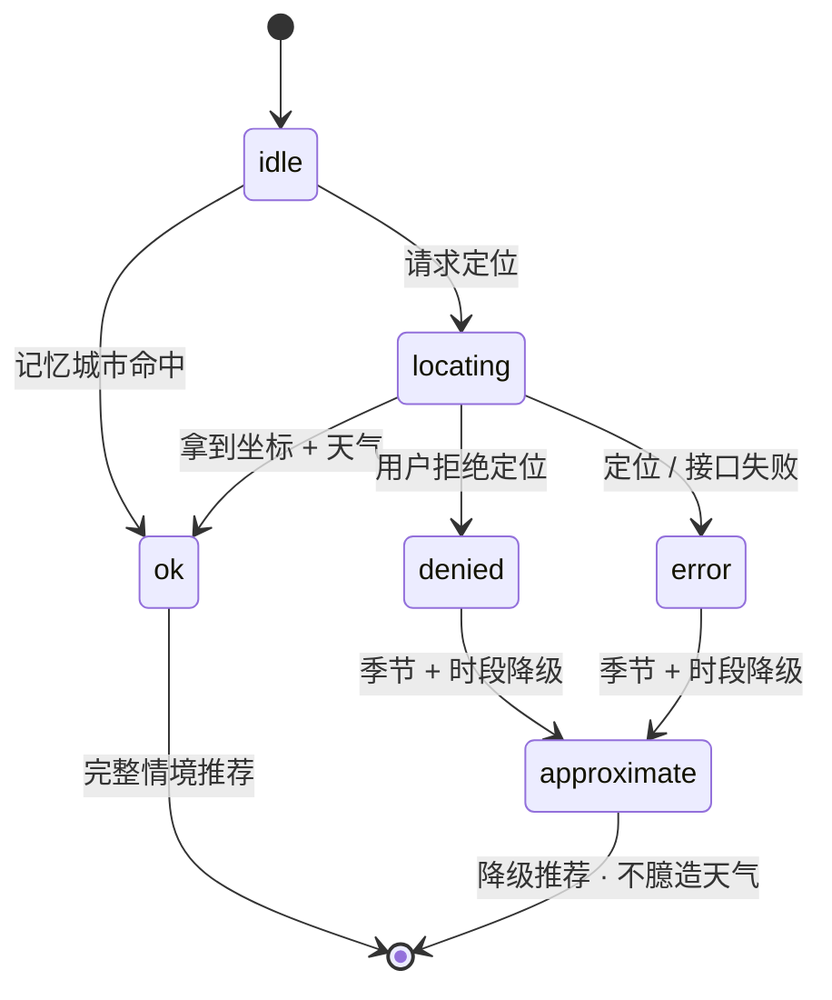

# 氛寸 · Fēn Cùn —— 完整产品方案

### 从香柜前的那三秒说起

**氛＝无形的氛围，寸＝有形的尺度。** 一个基于实时情境的个人「用香决策」Agent—— 
不帮你**挑**香水，帮你**用好**你已经拥有的香水。

&nbsp;

> **这份文档是什么**：README 是 30 秒的门面；这里是**完整答辩**。定位、市场判断、用户洞察、产品模型、系统架构、评分逻辑、MVP 边界、关键决策、商业价值、证伪指标、风险反驳、创始人能力——凡是会被面试官 / 投资人 / 评审追问的，这里都逐条讲清「怎么做」与「为什么这样判断」。
>
> **给不同读者的导航**：判断价值→ [一](#一--问题与机会) [二](#二--目标用户与真实痛点) [十三](#十三--商业价值与壁垒)｜产品思维→ [三](#三--产品方案先推荐--可换--教你怎么用) [十一](#十一--mvp-边界与优先级) [十二](#十二--关键决策创始人视角)｜技术可信度→ [五](#五--工程内核决策权在规则表达权在-llm) [六](#六--评分引擎从模糊直觉到可解释规则) [十](#十--系统架构与模块拆解) [十四](#十四--质量工程可信不是形容词)
>
> **配套文档**：[领域规则手册](领域规则手册.md)（每条规则的领域依据）· [数据工程](数据工程.md)（13.2 万 → 3.67 万 → 中文映射的完整管线）· [声音与文案](声音与文案.md)（产品怎么说话）

---

你站在香柜前。八瓶香水，今天穿深色、要见客户、外面 30℃ 闷。

你不缺香水——你缺的是那句判断：**今天到底该喷哪瓶、喷几下、会不会在会议室里太张扬。**
大多数人的解法是「无脑喷那瓶老相好」。于是另外七瓶常年吃灰，而那瓶老相好，在盛夏正午和冬夜地铁里其实是两种完全不同的东西。

氛寸接手的，就是这三秒。

---

## TL;DR

| | |
|---|---|
| **一句话** | 你已经有这些香水，氛寸帮你决定此刻该喷哪一瓶、并把它用得恰到好处。 |
| **和别的香水产品差在哪** | 国内产品都在帮你**买下一瓶**（香评、种草、导购、AI 调香）；氛寸只帮你**把手里的用好**。买只发生一次，用发生每一天。 |
| **为谁** | 已拥有 ≥3 瓶香水、常「喷错 / 喷多 / 喷得没存在感 / 不知道今天用哪瓶」的轮换型用户。 |
| **核心能力** | 推荐（香柜 × 此刻情境）→ 可换（决策权永远在你）→ **教你怎么用**（喷量·部位·社交距离·留香·裁决·为什么）。 |
| **技术内核** | 决策权在**确定性规则引擎**（前端本地、可复现、有单测），表达权在 **LLM**（听懂场景 + 翻成人话），天气只来自**和风天气 API**，全链路可降级。 |
| **状态** | 响应式 Web（今日 / 香柜 / 香历 / 我的四页闭环）已上线 [fencun.vercel.app](https://fencun.vercel.app)。 |

---

## 一 · 问题与机会

### 问题：香水的价值不在「拥有」，而在「此刻用得对不对」

同一瓶佛手柑，在 35℃ 盛夏正午和零度深夜地铁里，是两种香水。决定它好不好的，从来不是香水本身，而是它与**天气、体感、场合、以及你今天想成为谁**之间的关系。

现实是：多数人有 5–10 瓶香水，却只无脑喷那瓶「老相好」——另外几瓶常年吃灰，而那瓶老相好在盛夏正午和冬夜地铁里早已不合时宜。**人们不缺香水，缺的是站在香柜前那三秒的判断。**

### 机会：一个「国内空白 + 海外已验证」的确定性方向

系统梳理国内主流香水产品后，判断很清晰：

| 产品 | 定位 | 解决的问题 |
|---|---|---|
| 香水时代（NoseTime） | 香评百科 + 社区 + 商城 | 帮你**发现、购买新香水**（导购） |
| 嗅氪 AI 调香 | AI 定制调香 | 帮你**创造一瓶新香水** |
| **氛寸** | 用香决策 Agent | **管理你已有的香水，教你在不同情境下怎么用** |

国内没有产品把「**你的香水库 × 当前情境 → 今天喷哪瓶 + 怎么用**」这个闭环系统地做透。而海外（Sillage、NINU、Kaori、ScentWise、Aromoshelf）已在验证同一模式——例如 Sillage 每天清晨按温湿度从用户收藏中推荐当日用香。

> **创始人判断**：这不是赌一个没人要的新需求，而是把一个**已在海外被初步验证、却尚未进入中国**的模式率先本土化。相比「我发明了一个新需求」，这个判断更稳、更经得起面试与投资人追问。

---

## 二 · 目标用户与真实痛点

### 用户画像（诚实地窄）

不假装是「所有人」，而是清晰分层：

| 人群 | 特征 | 对产品的意义 |
|---|---|---|
| 🎯 **纠结的轮换者**（核心） | 有 3–10 瓶，每天纠结用哪瓶、怕喷错喷多 | 唯一的**每日高频**用户，留存基本盘 |
| **场合敏感者** | 关键场合（约会 / 面试 / 婚礼）临时求稳 | 事件触发的**低频口碑放大器** |
| **钻研型爱好者** | 懂香、在意用香礼仪 | 专业背书与高质量反馈的少数派 |

### 痛点拆解：把模糊的「不会用」拆成四个可被接住的瞬间

| 用户的真实困境 | 背后的决策缺口 | 氛寸如何接住 |
|---|---|---|
| 「今天到底喷哪瓶？」 | 缺**情境 → 香水**的匹配判断 | 今日之选：香柜 × 天气 × 场合打分推荐 |
| 「喷多少才不失礼？」 | 缺**扩散与场合**的分寸感 | 喷量档位 + 社交距离 + 密闭场合风险 |
| 「这瓶今天会不会翻车？」 | 缺**急性天气 / 反季**的预警 | 用香裁决 `avoid` + 天气突变预警 |
| 「好香买了却吃灰。」 | 缺**被遗忘香水**的再激活 | 吃灰提醒：合适情境顶出冷落瓶 |

> **产品洞察**：「今天喷哪瓶」其实是**弱痛点**——无脑喷老相好也不痛苦。真正让用户「咦一下」的，是产品替他发现了**他没意识到的问题**：那瓶好香在吃灰、那瓶常喷的今天会翻车。所以我把价值重心押在这两个**发现型钩子**上，而非假装「选香焦虑」是刚需——这是一个刻意的、反直觉的价值定位。

---

## 三 · 产品方案：先推荐 + 可换 + 教你怎么用

核心路径刻意平衡**推荐能力**与**用户自主权**：默认推荐满足懒人与新手，但推荐的是用户**自己已有**的香水（不引导购买、不冒犯），且随时可换——决策权始终在用户手里。无论接受还是换瓶，最终都进入同一层核心能力：**基于情境的精确用香建议**。

三层能力，缺一层就退化成「又一个选香工具」：

1. **推荐** — 你的香柜 × 此刻情境 → 最适合的一瓶。
2. **可换** — 一键换成你想喷的任意一瓶，用法即时重算。*（没有「可换」，推荐就成了强加。）*
3. **教你怎么用**（灵魂）— 喷几下、喷在哪、社交距离、留香区间、合不合时宜、有无风险、以及**为什么**。*（没有这一层，前两层就退化成选香工具。）*

> **战略表达**：「今天喷哪瓶」是**传播入口**——直观、一句话讲清、有国内首发感，负责拉新与制造话题；「这瓶怎么用」是**长期壁垒**——需要理解场景、偏好、喷洒方式并持续学习，是抄不走的慢变量。**用前者把人吸引进来，用后者把人留下。**

### 六个真实场景（说话口吻与介入时机）

| 场景 | 氛寸介入 | 它会说 |
|---|---|---|
| 早间通勤 | 打开即见今日推荐 | 「上海 28℃、湿度 80%、闷。从你的香柜选**蓝风铃**：清爽柑橘扛这种黏腻天。喷 2 下（手腕＋颈侧），别上身。今天它属于『走近才闻到』的距离。」 |
| 重要场合确认 | 输入「见客户」 | 「你选的**信仰之水**在商务场偏稳。但今天室内空调密闭，建议只喷 1 下、喷衣领内侧。」 |
| 换香后不确定 | 一键换香 | 「换成**烟草香草**没问题。它偏甜偏厚、扩散外放，今天 30℃ 建议减到 1 下、只喷手腕。」 |
| 🚩 **天气突变预警** | 情境刷新自动提示 | 「今天骤降到 12℃ 还下雨——你常喷的清新柑橘会被压住、留不住。库里**香料炸弹**更扛冷湿天，要不要换？」 |
| 🚩 **吃灰提醒** | 合适情境顶出冷落瓶 | 「这瓶你 35 天没碰了——今天干冷的天正是它的主场，翻出来？」 |
| 用后复盘 | 推荐卡下常驻一问（每瓶每天一次） | 「今天那瓶，刚好吗？〔淡了点 / 刚好 / 太冲了 / 不合场合〕」——一次点击，收敛明日用法；高温天答「淡了」会被归因给天气，不冤枉香水。 |

🚩 标记的两个是<b>发现型钩子</b>，也是氛寸真正的价值重心。

---

## 四 · 核心用户路径

---

## 五 · 工程内核：决策权在规则，表达权在 LLM

这是整个产品最重要的技术判断，也是它区别于「套壳 GPT」的地方。

**匹配打分、喷量 / 距离 / 留香判定，全部由确定性规则计算——可解释、可复现、可审计、有单测。LLM 只做两件事：听懂自然语言场景、把规则算好的事实翻译成有温度的人话。天气永远来自和风天气 API，绝不让 LLM 编造。**

| 任务 | 谁做 | 为什么这样分权 |
|---|---|---|
| 匹配打分、排序 | **规则引擎** | LLM 打分不可复现、不可审计；规则每一分都能拆给用户看 |
| 喷量 / 部位 / 距离 / 风险 | **规则引擎** | 这是壁垒，交给 LLM 会幻觉出「喷膝盖后侧 3 下」 |
| 自然语言 → 结构化情境 | **LLM** | 规则穷举不了「去前任婚礼」「第一次见投资人」，正是 LLM 所长 |
| 把结果翻成有温度的解释 | **LLM** | 让它像「懂香水的朋友」；但解释必须基于规则给定的事实，不准改结论 |

### 数据流与降级（产品不白屏）

> **AI 产品设计判断**：市面上太多产品把 LLM 放在决策链正中央，结果不可复现、会幻觉、还贵。我的选择相反——**让 LLM 待在它真正擅长的两端（理解与表达），把中间的决策交给可审计的规则**。这既是技术可信度，也是成本控制：LLM 挂了，规则引擎照样出推荐与模板用法。

---

## 六 · 评分引擎：从模糊直觉到可解释规则

香水适配极度模糊，目标是把它拆成**每一分都能向用户解释**的确定性公式（`src/lib/scoring.ts`）。

**基于真实数据诊断的刻意判断：**

- **场合权重（0.43）略高于季节（0.38）**——「今天去哪儿」比「现在什么季」更该决定喷哪瓶；急性温度由乘性 W 兜底。
- **质量先验压成 ±4%（0.96–1.04）**——曾出现「不管什么场景都推同一瓶」，诊断发现是社区高分香靠质量分跨场景通吃。压成轻推后，同一柜子里由**场景 / 季节 / 天气**决定喷哪瓶，而非社区评分替你决定。
- **时段项相对自身主场归一**——与季节项同构，让「白天香 / 夜香」这个维度真正发挥它的权重，而不是被原始占比稀释。
- **场合分低分区软下限保序**——同质香柜遇不匹配场合时不会一起塌成同分，保证「让不同气质在不同场合拉开」。
- **近似同分按本地日稳定轮换**——先严格按分排序、再对近似同分做单调聚簇、仅簇内轮换（不把 epsilon 写进比较器：epsilon 比较器不满足严格弱序，会出现分高者排后）。种子取本地日历日，跨天在本地零点切换而非 UTC 零点——「今日推荐」不能在早上八点换答案。
- **轮换与新鲜度只动排序、不动裁决**——排名分 = 内容分 × 新鲜度 F(d) × 换瓶隐式差评。昨天刚喷的今天自然让位（d=1 → ≈0.58，一周后归位），久置的自然浮起；「这瓶适不适合今天」与「要不要连着喷它」是两个问题，所以裁决与展示用内容分、排序用排名分。

场合贴合分按**真实香调家族**判定（约会奖甜 / 花、罚泥土木质；正式奖干净木质 / 柑橘、反甜反炸；运动奖清新、罚甜重）——不是泛泛的「适合约会」，而是可拆解的加减分。

### 四条戒律（继续开发必须守）

1. **不伪精确** — 留香 / 喷量 / 社交距离只给区间与档位，绝不给「6.2 小时」这类无法验证的假数字。*无法验证的精确会摧毁信任。*
2. **不过度设计** — 不上向量库；规则引擎在浏览器本地毫秒出结果。何时才需要向量库？从「库内决策」扩展到「全库语义发现」时——在那之前一行都不写。
3. **轻冷启动** — 搜名秒加建香柜，不逼用户先填问卷。
4. **有反馈闭环** — 每次推荐都能被评价、被修正，个人偏移持续收敛。

---

## 七 · 不迁就 · 用香裁决

好的建议不能只会讨好。氛寸对每次推荐给一个明确裁决 `good / caution / avoid`：

- 天气极端、严重反季、密闭场合遇张扬香 → 判 **`avoid`**，先说「今天不太建议用这瓶」，**再告诉你坚持要用时怎么补救**（减到 1 下、喷衣内侧……）。
- LLM 的解读被规则约束：裁决为 `avoid` 时，它不准把话圆回「其实也挺合适」——这条**从提示级升到了代码级**：LLM 返回若不含否定语义，服务端自动回退确定性模板（详见[第十四章](#十四--质量工程可信不是形容词)）。

> 一个真会替你踩刹车的助手，比一个永远说「都很棒」的助手可信得多。这是「分寸感」在产品性格上的落地。

---

## 八 · 越用越懂你 · 反馈闭环与个性化

出门归来，答一句「今天，刚好吗？」——`淡了点 / 刚好 / 太冲了 / 不合场合`（每瓶每天一次，刷新页面不会重复计入）。

这条反馈**按瓶**聚合成个人偏移，喂回打分与用法，且每一档都有明确去向：

- **太冲了** → 下次帮你少喷，并附带轻微的偏好降权；
- **淡了点** → 先做**环境归因**：高温/闷湿天的「淡」是天气吃掉了留香，这笔算天气的、不动你的喷量校准（回复也会明说）；正常天气才记为「这瓶在我身上偏淡」；
- **刚好** → 沉淀为**成功配置**（温度档 × 场合 × 喷量），下次同样情境跳过通用规则、直接照那次的量来，并明说「按你上次满意的配置」——**校准必须被感知，被感知的校准才是留存钩子**；
- **不合场合** → 只降它在**这个场合**的权重，别的场合不受牵连；
- 此外，**把主推手动换掉也是一票**（隐式差评）：7 天内两个不同天被换掉，它就先让位一段时间。

所有偏移正负双向、有界、按月轻度衰减——口味会变，偏置不能只增不减、锁死不动。关键克制：反馈只对「你的这瓶」做个人化偏移，**不污染全局社区投票**——它是「这瓶怎么用」长期个人化的数据来源，而不是又一个被平均掉的评分。

> **诚实的前提**：这条「越用越懂」是慢变量，靠时间和真实反馈长出来——它对「只喷不反馈」的被动用户不会自动收敛。所以冷启动期用**全局规则兜底体验**，并把复盘压到「一次点击」、换香/吃灰采纳自动登记，尽量降低留下信号的成本。这一点在面试里我会主动讲，而不是假装飞轮对所有人自动转。

---

## 九 · 数据：每条建议都来自真人使用反馈

**核心原则：氛寸的每条建议都来自真人社区投票，而非厂商宣称。** 厂商说「持久 8 小时」不可信，三千人投票的均值可信。

数据来自 **ledecanteur**（Fragrantica 社区数据），longevity / sillage / seasons / daypart 全是社区**投票计数**。

| 环节 | 处理 |
|---|---|
| **原始数据** | 约 13.2 万款 → 按投票数 ≥ 50 筛得约 **3.67 万款**精选子集 |
| **主目录** | 热度 **Top 1500 款**全中文精选，构建期预计算季节拉普拉斯平滑占比、日夜占比、扩散四档、风格标签 |
| **扩展集（数据分层）** | 其余 **3.6 万款**：搜索索引首次搜索时懒加载（gzip ≈ 756 KB）+ 64 个详情分片按需取（单片 gzip ≤ 95 KB）；含 **785 款国货白名单**（观夏 / 闻献 / RE调香室 等，低票记录标 `lowVotes`、社区统计仅供参考） |
| **统一榜单（搜索口径）** | 主目录与扩展集的候选**合并重排、不分区**（`rankSearchHits` 纯函数，可单测）：文本匹配档位优先（命中名称 > 命中名称＋品牌 > 仅模糊），同档位按社区投票的主流度；不做「更多结果」式折叠——真实用户反馈证明，区隔会让人以为上面没有匹配。仍搜不到还有**手动记一瓶**兜底——香柜是推荐引擎的唯一输入，每一瓶都进得来 |
| **中文化（体验生死线）** | 香调 / 气味词近全覆盖；香名 **89%**（1335/1500，保守映射官方名 / 香圈绰号 / 忠实直译，无可靠中文名者诚实回退英文——错的中文名比英文更糟）；品牌**映射 100%**：有通行中文名的已补齐（约 120/241），Byredo、Le Labo 等百余小众品牌按香圈惯例保留英文 |
| **产物** | 原始数据不入仓库，只提交构建产物（主目录 `perfumes.min.json` 1.6 MB · gzip ≈ 262 KB；扩展集 `ext-index.json` + `ext/` 分片），浏览器本地毫秒检索与打分 |

> **工程落地判断**：「小而全中文」与「大而露英文」不是二选一——**分层**可以两全。主目录 1500 款做到中文近满覆盖负责体验，扩展集 3.6 万款保留英文原名负责兜底：搜到英文原名，永远好过搜到一个错误的中文匹配，也永远好过搜不到。

---

## 十 · 系统架构与模块拆解

### 模块拆解（`src/lib` 为纯逻辑核心，约 1800 行 TypeScript）

| 层 | 模块 | 职责 |
|---|---|---|
| 情境层 | `season.ts` · `/api/context` · `/api/parse-intent` | 季节 / 体感 / 时段推断；实时天气；自然语言场景解析 |
| **决策层（壁垒）** | `scoring.ts` · `usage.ts` · `recommend.ts` | 打分排序；喷量 / 部位 / 距离 / 留香 / 风险；编排 + 用香裁决 |
| 检索层 | `perfumes.ts` | 目录加载 + 中英文分词搜索；主目录与扩展集**统一榜单排序**（`rankSearchHits`）；扩展索引懒加载 + 64 详情分片按需取 |
| 个性化层 | `recommend.aggregateBias` · `hooks.useNudges` | 反馈 → 个人偏移；发现型钩子（天气预警 / 吃灰提醒） |
| 记录层 | `journal.ts` | 香历纯函数层：月历网格、当日快照、主香调归族、备选差异标签——无副作用、可单测 |
| 表达层 | `/api/explain` · `numguard.ts` · 模板兜底 | LLM 解读；**数字白名单**拦截事实之外的编造数字；失败降级为规则要点 |
| 状态层 | `store.ts`（Zustand + localStorage） | 香柜 / 反馈 / 用香计数持久化，`Storage` 接口已抽象，可平滑换云端 |

### 情境获取状态机（韧性设计）

无论定位成功、被拒还是接口失败，产品都要能出推荐——这是「不白屏」的工程保证。

### 技术栈与选型理由

| 层 | 选型 | 说明 |
|---|---|---|
| 框架 | **Next.js 16**（App Router）+ **React 19** + **TypeScript 5** | 一仓库承载前端与轻后端 |
| 后端 | **Route Handlers** | 代理和风 / DeepSeek，保护 key + 缓存 + 限流 + 降级 |
| 样式 | **Tailwind v4**（CSS-first `@theme` token，**无 UI 组件库**） | 昼夜双主题、自持字体，源码级可控、不堆砌 |
| 决策 | **确定性规则引擎**（纯 TS，前端本地） | 可解释、可复现、可审计、有单测；零延迟零成本 |
| 检索 | **MiniSearch 7**（自定义中英文分词） | 搜名 / 品牌 / 香调秒加 |
| 状态 | **Zustand 5** + localStorage | 香柜与反馈持久化，接口已抽象可换 Supabase |
| 语义 | **DeepSeek**（`deepseek-v4-flash`） | 场景解析（`json_object` + zod 校验）+ 自然语言解读 |
| 天气 | **和风天气 QWeather** | 服务端调用 + 30 分钟网格缓存，失败退化「仅季节 + 时段」仍可推荐 |
| 部署 | **Vercel** | GitHub 自动部署 |

> **工程分层原则**：重计算（打分）在前端本地，重 key / 隐私（天气、LLM）在服务端，重数据在构建期固化成静态 CDN 资产——三者不混。

---

## 十一 · MVP 边界与优先级

MVP 的价值不在功能多，而在**每一处克制背后都有判断**。反复问自己：「**不做这个，核心闭环会不会断？**」

**✅ MVP 之内（跑通「情境 → 决策 → 用法 → 反馈 → 记录」核心闭环）**
四页闭环 · 搜名秒加（主目录与扩展集统一榜单 + 手动记一瓶兜底）· 规则推荐 + 用法 · 轮换新鲜度 + 换瓶隐式差评 · 一键换香 · 用香裁决 · 四档反馈 → 个人偏移 · 香历 · 自然语言场景输入 · 天气突变预警 + 吃灰提醒 · 昼夜双主题 · 偏好画像 · API 限流与全链路降级 · 数字白名单 · 目录加载韧性 · 香柜导出/导入 · 引擎单测 · 证伪指标埋点。

**🕒 刻意后置（不在闭环主线上，验证通过后再做）**

| 后置项 | 为什么现在不做（阶段策略，而非能力缺失） |
|---|---|
| 账号体系 / 云同步 | MVP 用 localStorage 最快验证核心决策价值；`Storage` 接口已抽象，走「设备匿名 id 先行、后接账号」路径，业务层零改动。当前已提供**香柜导出 / 导入 JSON** 兜住数据丢失 |
| 向量库 / 语义检索 | 当前全是结构化字段的数值比较，规则引擎直接算；向量库是「全库语义发现」阶段的工具，提前上是「PPT 复杂度」 |
| 按用户拟合的在线模型 | 冷启动阶段每用户样本量只有 O(数十)，任何拟合都是过拟合；改用「全局规则 + 个人硬偏移」，简单、当场可感 |
| UGC 社区 / 商城变现 / 穿搭图像识别 | 不在「今天怎么用」这条闭环主线上，一律后置，避免资源发散 |

---

## 十二 · 关键决策（创始人视角）

作品集的价值，在于每一处克制背后的判断。以下是可被追问的硬决策：

| 决策 | 我的判断 | 体现的能力 |
|---|---|---|
| **不做导购，做「买之后」** | 国内所有产品都停在「买」，「用」是每天真实发生却无人接手的空白 | 问题定义 · 商业判断 |
| **价值重心押在两个发现型钩子** | 「今天喷哪瓶」是弱痛点，「替你发现吃灰 / 翻车」才是增量价值 | 用户洞察 · 产品抽象 |
| **决策归规则、表达归 LLM** | LLM 在决策链正中央 = 不可复现 + 幻觉 + 高成本 | AI 产品设计 · 技术理解 |
| **不伪精确** | 敢于不精确本身就是产品判断——无法验证的精确会摧毁信任 | 产品性格 · 信任设计 |
| **不迁就用户的用香裁决** | 一个会替你踩刹车的助手，比永远说「都很棒」的助手可信 | 产品性格 · 差异化 |
| **小而全中文 > 大而露英文** | 中文缺失直接摧毁国内体验，聚焦 1500 款 | 资源聚焦 · 工程落地 |
| **localStorage 先行 + 接口抽象** | 先用最轻的存储验证决策价值，不赌未被验证的架构 | 系统架构意识 · MVP 边界 |

---

## 十三 · 商业价值与壁垒

### 竞争与壁垒（诚实版）

有人会问：香水时代两周就能抄「今天喷哪瓶」，壁垒在哪？

**诚实地说，产品形态本身没有护城河**——「今天喷哪瓶」这个交互，别人也能仿。氛寸真正押的是两件抄不走的事：

1. **在位者的动机错配窗口期**。香水时代、电商这类在位者，KPI 与货架逻辑都指向「卖下一瓶」，「帮你把已有的用好」是它们**看不上的低优先级长尾**——不是做不了，是没动力做。我赌的就是这个时间差，为自己争取先发的心智窗口。
2. **随时间加深的个人化数据**。「按瓶个人偏移」越用越准，是抄形态抄不走的慢变量——它对「只喷不反馈」的被动用户不会自动收敛，所以我用低摩擦反馈 + 采纳登记去尽量把飞轮带起来。

> 承认形态可被复制，恰恰是成熟的竞争判断——比硬说「别人结构上不可能做」更经得起追问。

### 可衡量的价值指标（敢被证伪，且已埋点）

为这个方向设计了两个**证伪指标**，让产品「可被数据推翻」，并已落到本机埋点（换香 / 吃灰采纳的原始计数，随香柜数据一起导出即可复核）：

- **换香率** — 用户是否真的接受「换一瓶」建议？若永远喷第一瓶，说明没创造增量决策价值。
- **吃灰瓶采纳率** — 被顶出的冷落瓶是否真的被重新使用？这是「发现型钩子」价值的直接度量。

### 商业模式（守住非导购）

长期变现卖「**分寸**」本身——订阅高级版（更细的个人香水画像、年度用香回顾、季节轮换指南），**不碰交易、不种草**。这既守住定位的纯粹，也与在位者的导购逻辑形成结构性区隔。

---

## 十四 · 质量工程：可信不是形容词

「可复现、可审计」若没有工程支撑就是空话。氛寸把它落到了实处：

| 维度 | 落地 |
|---|---|
| **确定性单测** | `npm test`（Node 内置 runner + tsx，**38 用例**：`engine.test.ts` 32 · `journal.test.ts` 5 · `search.test.ts` 1）锁定：权重归一、各 Fit 边界、天气乘子方向、软下限保序、用香裁决、备选去重、喷后有效距离档，以及**排序不变式（分高者在前）、喷量区间不变式（lo ≤ hi）、轮换新鲜度、环境归因、成功配置复用、数字白名单、香历日期与月历、统一榜单排序**。重构改错权重会被当场逮住 |
| **全链路降级** | LLM 超时 → 规则模板兜底；定位失败 → 季节 + 时段降级、不臆造天气；`avoid` 裁决 LLM 若软化否定语义 → 代码级回退模板；**LLM 输出含事实之外的数字（编造的「6.2 小时」）→ 数字白名单拦截、整段退模板**；三条 API 路由入参全部 zod 校验；`search.test.ts` 用**真实构建产物**做端到端回归——国货与长尾必须出现在统一榜单头部、主流版本优先 |
| **加载韧性** | 香水目录（1.6MB JSON）加载失败自动重试；失败且本地有香柜时明确提示「数据没丢 + 重试」，绝不把满柜误显示成空柜 |
| **数据韧性** | 香柜 / 反馈本机存储，提供导出 / 导入 JSON + 诚实的存储告知 |
| **对抗性自审** | 对自己的产品做过多轮**第一性原理对抗性审查**（六维度 + 核验，记录见提交历史），持续以「哪里还站不住」的视角打磨 |

> 工程严谨与自我批判，是我作为创始人的一部分——把「可信」从形容词变成可运行的命令。

---

## 十五 · 边界与诚实

- **高频基本盘其实窄**：真正每天打开的只有「纠结的轮换者」；「场合敏感者」是事件触发的低频口碑放大器，「钻研型爱好者」是专业背书的少数派。不假装全员高频。
- **需求敢被证伪**：内建换香率与吃灰采纳率两个证伪指标；若用户从不换、永远喷第一瓶，说明没创造增量决策价值。
- **数据目前在本地**：无账号体系，localStorage 持久化 + 导出备份，暂无跨端同步；迁 Supabase 走「设备匿名 id 先行、后接账号」路径，接口已抽象、业务层零改动。
- **刻意暂不做**：UGC 社区、商城 / 种草变现、穿搭图像识别——不在闭环主线上的一律后置。

### 最尖锐的三问

评审最可能一票否决的三个问题，我不等人问，先自己答。

**「这不就是 Prompt 套壳？」**
套壳能复刻第一天的氛寸，复刻不了三个月后的：13.2 万条数据洗到 3.67 万、再做中文映射的脏活；规则 × LLM 分权加数字白名单的工程；以及只属于每个用户自己的反馈序列。壳一天能抄，这三样抄不动。

**「用户第二周还会打开吗？」**
我不押「推荐哪瓶」，押「怎么用」：同一瓶在不同天气下建议不同；用得越久，理由越多来自你自己的历史——「按你上次满意的配置」是已实现的代码，不是愿景。定位也诚实：这是周活产品，健康指标是留存与反馈率，不是 DAU。

**「怎么证明不是伪需求？」**
我承认「喷哪瓶」是弱痛点，真需求在别处：知识缺口、好香吃灰、社交风险。所以内建换香率与吃灰采纳率两个证伪指标——数据若长期打脸，我接受方向被推翻。

---

## 十六 · 路线图

**已上线** ✅
四页闭环（今日 / 香柜 / **香历** / 我的）· 搜名秒加（**主目录与 3.6 万扩展集统一榜单：文本档位优先、同档位按主流度，手动记一瓶兜底，含国货白名单**）· 规则推荐 + 用法 · **轮换新鲜度 + 换瓶隐式差评** · 一键换香（**备选带差异标签：更收敛 / 留香更久 / 换个气质**）· 用香裁决 · **四档反馈 → 个人偏移（环境归因 / 成功配置复用 / 按月衰减）** · **香历：穿香日历 + 当日快照 + 一句话手记（记录资产层）** · 自然语言场景输入（**含关系张力 / 时长档 / 饭局开关**）· 天气突变预警 + 吃灰提醒 · 昼夜双主题 · 偏好画像 · API 限流与全链路降级 · **数字白名单反伪精确** · 单测（38 用例，含真实数据搜索回归）· 证伪指标本机埋点 · 目录加载韧性 · 香柜导出/导入（zod 深校验）。

**中期 · 深化个性化与资产化** 🌱
香名中文化冲 95%＋ · 反馈飞轮扩到多维画像（怕甜 / 怕冲 / 某调性敏感）· 香历月度小结分享图与季节轮换报告 · 迁 Supabase（账号 / 跨端同步）· 证伪指标从本机埋点接入服务端度量。

**长期 · 变现（守住非导购）** 💎
订阅高级版：个人香水画像、年度用香回顾、季节轮换指南。

---

## 十七 · 关于创始人：能力映射

这个项目由我**独立主导并完成从 0 到 1 的完整闭环**——问题定义、市场判断、产品设计、算法规则、全栈工程、上线部署，无一外包。

| 能力 | 在项目中的具体体现 | 证据位置 |
|---|---|---|
| **问题定义** | 从「有香水却不会用」提炼出「用香决策」这一被忽视的高频问题 | [一](#一--问题与机会) |
| **用户洞察** | 识别「今天喷哪瓶是弱痛点」，把价值重心押在两个发现型钩子 | [二](#二--目标用户与真实痛点) |
| **产品抽象** | 「先推荐 + 可换 + 教你怎么用」三层能力模型 | [三](#三--产品方案先推荐--可换--教你怎么用) |
| **需求拆解** | 把模糊的「不会用」拆成喷量 / 部位 / 距离 / 留香 / 裁决可执行输出 | [六](#六--评分引擎从模糊直觉到可解释规则) |
| **AI 产品设计** | 决策归规则、表达归 LLM 的分权架构，规避幻觉与不可复现 | [五](#五--工程内核决策权在规则表达权在-llm) |
| **技术理解 / 系统架构** | 三层分层、全链路降级、状态机韧性设计 | [十](#十--系统架构与模块拆解) |
| **MVP 边界判断** | 以「不做会不会断闭环」为准绳的功能取舍 | [十一](#十一--mvp-边界与优先级) |
| **商业判断** | 竞品分析、诚实版壁垒、非导购变现、证伪指标 | [十三](#十三--商业价值与壁垒) |
| **工程落地 / 质量意识** | 数据管线、中文化生死线、单测、降级、真实上线运行 | [九](#九--数据每条建议都来自真人使用反馈) [十四](#十四--质量工程可信不是形容词) |
| **战略表达** | 把复杂功能包装成克制、可传播、经得起追问的叙事 | 全文 |

---

## 附 · 设计语言 · 明韵 / 暗香

设计目标：精致、简约、高级、可信——像「懂香水、懂场景、懂表达」的智能体，而非查询工具。

- **双嗓音排版**：中文用**思源宋体 Noto Serif SC**（手账感、差异化），西文与数字用 **Fraunces** 衬线，自持字体、按需子集。
- **昼夜双主题**：白天宣纸暖白、高对比近黑；夜晚中性炭黑 + 暖奶白 + 香槟金点缀。手动切换并记忆。
- **可信化表达**：香调 0–100 渲染为横向证据条、季节匹配点、扩散四档；留香给「大半个白天」不给「6.2 小时」。
- **克制动效**：只在卡片入场、证据条增长、换瓶重排三处用，禁循环 / 视差 / 弹跳。
- **品牌化术语**：香柜 · 今日之选 · 换一瓶 · 分寸建议 · 「今天，刚好吗」· 此刻 · 香历 · 气味档案。

---

**氛寸** —— 让每一瓶香，都用在它最好的那一刻。

**「我做的不是香水导购，是香水的天气预报。」**

[在线体验](https://fencun.vercel.app) · [30 秒速览 README](../README.md)

